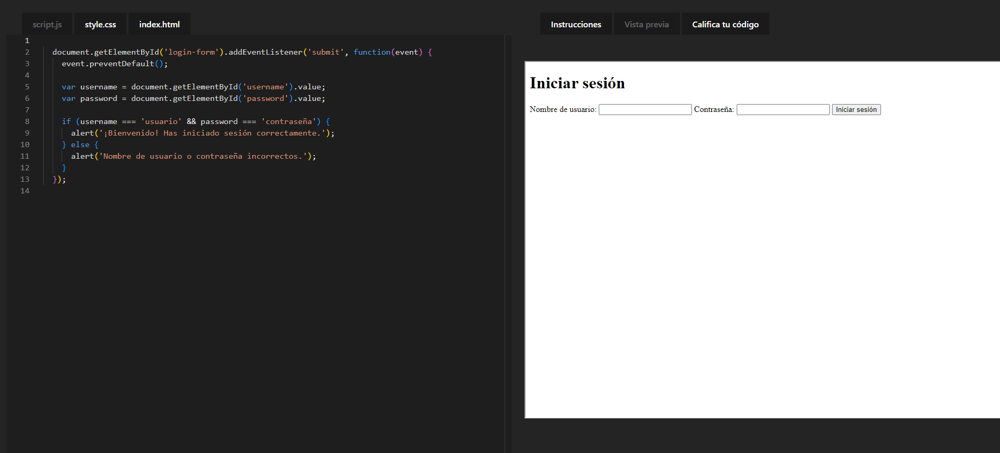
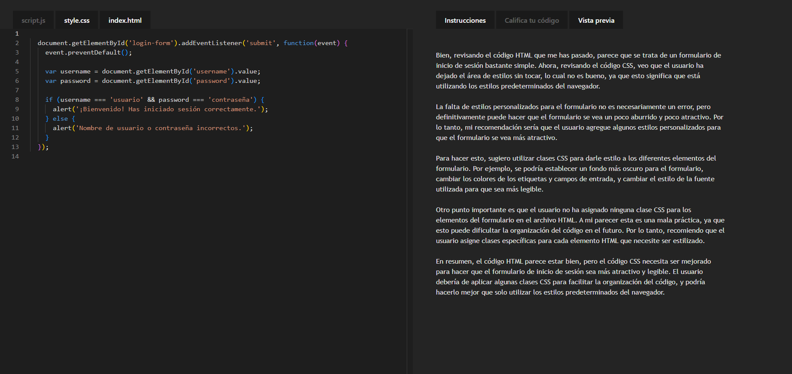
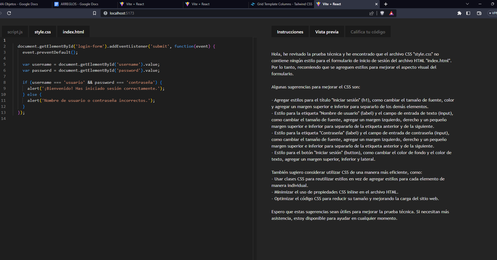

# REVISOR DE CODIGO AUTOMATIZADO

## Descripción

Este proyecto es un revisor de código automatizado, el cual se encarga de revisar el código de un estudiante y compararlo con el código de un profesor, para así determinar si el código del estudiante es correcto o no.

## Requisitos

- [API_KEY DE Open IA](https://openai.com/)

### VISTA DE LA APLICACIÓN

